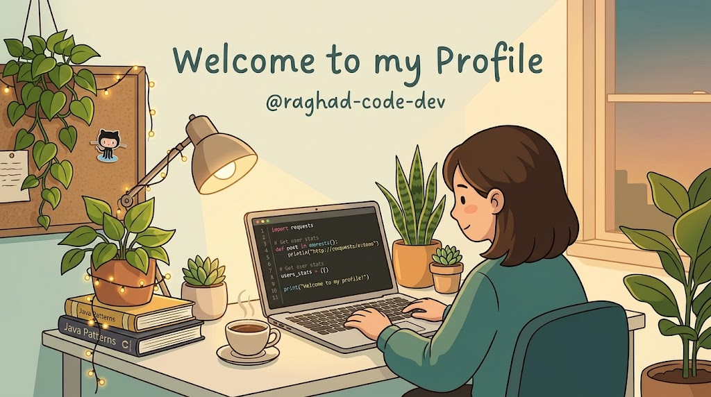

  

<h1 align="center">Hi there, I'm Raghad 👋 ✨</h1>

  

- 🎓 **Information Technology Student** at the Islamic University of Gaza  
- 💻 Passionate about **Software Development** & Problem Solving  
- 📚 Enthusiastic about continuous learning and modern tech solutions

---

### 🛠️ Languages & Technologies

  
  
  

---

### 📌 Academic Focus & Interests
- ☕ **Core Java**: Object-Oriented Programming (OOP), Swing GUIs, File I/O, and Data Structures.
- 🧩 **Computer Science Foundations**: Digital Logic Design & Discrete Mathematics.
- 🎨 **Creative Pursuits**: Reading novels, digital content creation, and software design.

---

### 📊 GitHub Stats & Visitors

  

  

---

  <i>"Code is like humor. When you have to explain it, it’s bad."</i> ✨

